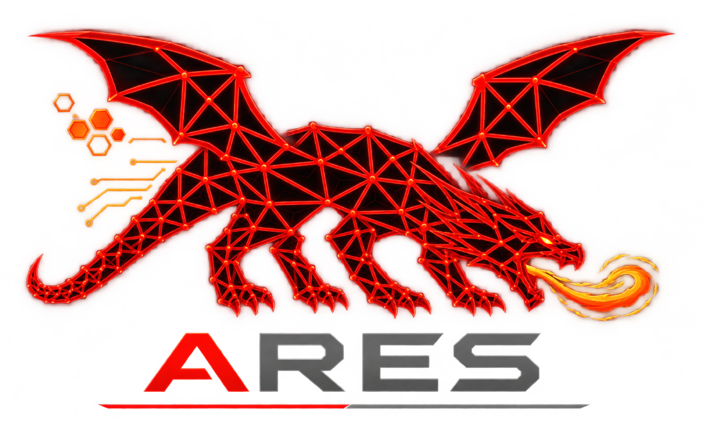

<div align="center">

  <!-- ARES Cyber Dragon Logo -->
  

  <br/>

  <!-- Dynamic Typing SVG Header -->
  <a href="https://github.com/Mafifrizi/ARES">
    
  </a>

  <p><i>Tangerang, Indonesia</i></p>

</div>

---

### 💻 Operator Terminal

```bash
$ whoami
kraii_ [Information Systems Auditor & Security Researcher]

$ cat /etc/ares/focus.txt
Bridging enterprise audit rigor with autonomous red team automation.
Engineering ARES™ to validate Active Directory attack paths, test defensive
telemetry, and assess modern EDR detection resilience.
```

---

### ⚔️ Flagship Project: [ARES™ (Automated Red Team Engagement System)](https://github.com/Mafifrizi/ARES)

> An offensive automation framework engineered for authorized adversary emulation, attack path discovery, and defensive control validation.

- **Active Directory Graph Exploitation**: Automated path traversal toward Tier-0 Domain Controllers leveraging BloodHound DAG telemetry.
- **Modular Adversary Emulation**: 62 purpose-built offensive modules spanning Kerberoasting, DCSync, AS-REP Roasting, ADCS escalation, and memory operations.
- **Defensive & Telemetry Validation**: Assessing detection coverage, telemetry collection, and logging blind spots across modern EDR solutions.

<div align="center">
  <br/>
  
  
  <br/>
  
  
  <br/>
  
  <br/><br/>
  <a href="https://github.com/Mafifrizi/ARES">
    
  </a>
  <br/><br/>
</div>

---

### 🛡️ Domains & Specialization

| Domain | Focus & Architecture |
| :--- | :--- |
| **Systems Auditing** | Enterprise internal control testing, security baselines, identity governance |
| **Active Directory Security** | Domain trust relationships, ACL abuse, Kerberos delegation & Tier-0 protection |
| **Adversary Emulation** | Attack graph automation, OPSEC-aware execution, EDR evasion research |
| **Offensive Tooling** | Scalable security architectures, graph traversal algorithms, automation engines |

---
